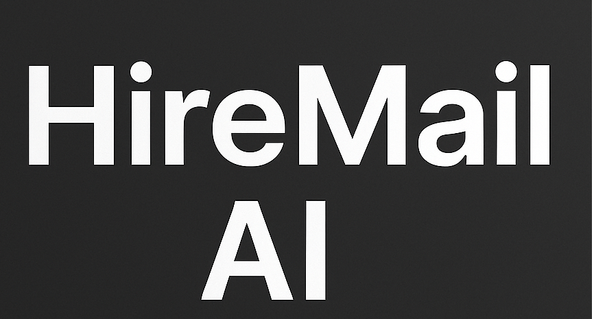

# HireMail AI

**AI-powered Job Application Automation Platform**  
Automates resume tailoring, cover letter generation, and job application submission using a coordinated multi-agent AI system, while keeping you fully in control.

---

# HireMailAI.in

> **Status: V1 Core Build Complete — Awaiting Compliance**
> HireMailAI.in has finished its primary development phase. We are currently navigating mandatory security audits and state certifications required for a public release.

### 🚀 Progress Highlights
- **Backend & Frontend:** 100% of core V1 features implemented.
- **AI Engine:** Multi-agent resume tailoring and application automation is fully operational in internal staging.

### 🛠️ Current Focus
* **Compliance:** Navigating the **Gmail API Restricted Scope** verification (CASA Tier 2).
* **Infrastructure:** Finalizing production scaling and security hardening.

### 🚧 External Blockers
* ⏳ **Google OAuth:** In the queue for final security review for restricted scopes.
* 🏛️ **Business Certification:** State-level processing (Under review as of Jan 2026).

### 🎯 Launch Target
* **Public Beta:** Expected **Q2 2026**.

⭐ **Star this repo** to get a notification the moment we clear these hurdles and open the public beta!
---

## 📉 The Real Problem
Applying for jobs is time-consuming and repetitive:

- Reading job descriptions, tailoring resumes, and crafting cover letters takes significant time per application.  
- Generic templates reduce response rates; manual tailoring doesn’t scale.  
- Repetitive workflows lead to fatigue and mistakes in critical documents.

---

## 💡 The Solution — End-to-End Automation
HireMail AI automates the repetitive parts of job hunting while keeping the user in control:

- **Tailor:** Resume customized to each job description  
- **Write:** Job-specific cover letter generation  
- **Apply:** With approval, applications can be sent directly to recruiters via Gmail  

---

## ⚙️ Core Features

### **Multi-Agent System**
- Constructed a multi-agent system to automate resume tailoring and job application submission.

### **Auto-Diagnostic Agent**
- Boosted system reliability by **60%+** by autonomously detecting, reporting, and resolving runtime issues.

### **LLM Factory Handler**
- Engineered a factory handler for seamless multi-LLM orchestration across **OpenAI, Mistral, Gemini, and Hugging Face Hub**.

---

## 🎥 Demo
**Watch Full Demo →** YouTube Video

---

## 📬 Contact
For a technical walkthrough or architecture discussion:

- **Email:** bharath.workmail@gmail.com  
- **LinkedIn:** (add your LinkedIn profile link)
---
